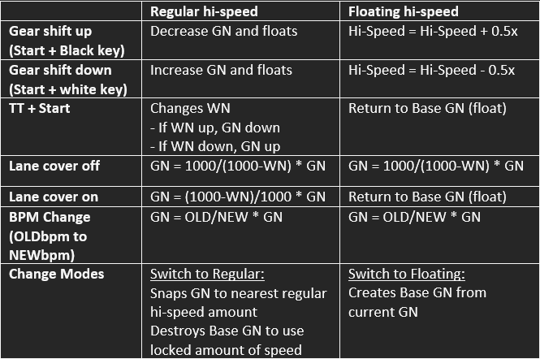

# Regular Hi-speed vs Floating Hi-speed

Here is a comparison table for performing different actions between the 2 Hi-speed modes.

## Floating Hi-speed

**Advantages:**

- More versatile because of Base GN storage
- Allows you to experiment with lane covers once you find a comfortable Green Number without changing it
- Floating is easier to perform using compared to Regular Hi-speed, and can also be performed by enabling the lane cover

**Disadvantages:**

- Changing Base GN between charts when dealing with soflan charts is more cumbersome
- Can accidentally float when trying to gear shift near a scratch note

## Regular Hi-speed

**Advantages:**

- More simple, especially helpful for new players
- Allows changing GN mid chart without gear shifting (SUDDEN+)
- Gear shifts are in smaller increments, which makes gear shifting before soflan more precise

**Disadvantages:**

- It is more difficult to float, especially when you need to get a quick float in
- Much more difficult to use for complicated soflan charts

For these reasons, all chart guides on this site will use **Floating Hi-speed**. However, feel free to get creative with the simpler soflan charts as Regular Hi-speed can definitely pull its weight.