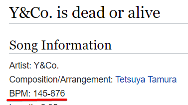

# GN/WN and Soflan Basics

The backbone of almost every technique here.

## What are green number and white number?

Unless you are a new player, you have probably seen (or are using) these Note Chart Display Area options.

Your **green number** essentially refers to your scroll speed based on the amount of time the notes appear on screen. This means that a higher green number will net you a lower scroll speed, and a lower green number will net you a higher scroll speed.

If you are using any of these previously mentioned options, your **white number** refers to be how far down the playfield a given lane cover is out of 1000. For example, if you have a SUDDEN+ lane cover halfway down the lane, you will have 500 white number.

Both of these numbers will be visible at the top of your screen while you are holding start (or on the speed panel for regular Hi-speed).

## What is Soflan?

Quite literally the entire reason this website exists, what the game refers to as Soflan. Named after the IIDX 2nd Style chart "SOFT LANDING ON THE BODY", Soflan refers to abrupt or gradual speed changes during a IIDX chart. 

As you will see by watching [this](https://youtu.be/1Z60nSrGiJ4?t=65) timestamped video of the chart at 1:05 (or opening the image below in a new tab), your scroll speed can change depending on the bpm of the song. While this may seem manageable for a chart like this which only speeds up for about 4 seconds, not all charts are like this.

## What can be done about Soflan?

But wait, I can't read at 876bpm!!!! That's ridiculous. Well, this is where [Floating hi-speed](float_hs.md), and subsequently any techniques based off of floating hi-speed, come into play.